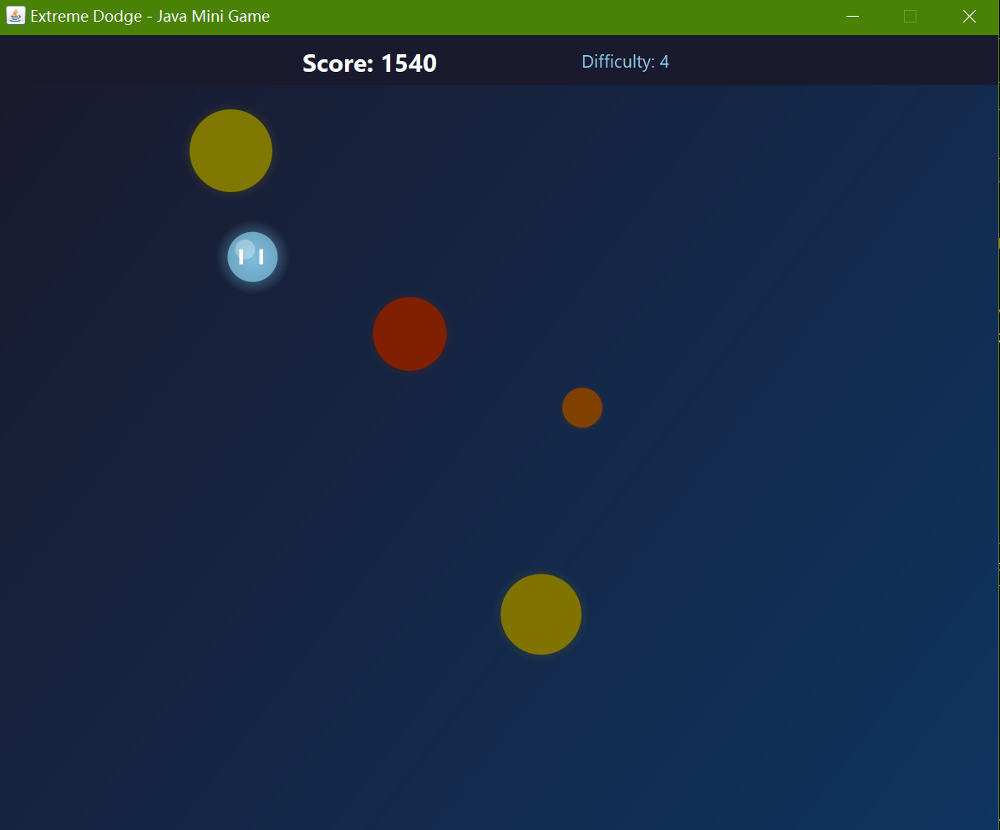

# Extreme Dodge (Java Swing & HTML5 Version)



## Description
_Extreme Dodge_ is a fun and challenging game where you dodge incoming obstacles to survive as long as possible, featuring simple yet addictive gameplay mechanics.

This version shares identical in-game content with [Extreme Dodge (VB.NET & Python Version)](https://github.com/Pac-Dessert1436/Extreme-Dodge-VB-Python). It serves as my personal attempt to rewrite the game using Java and HTML5, so further details about the game itself will not be repeated here.

## How to Play
1. Clone the repository and navigate to the project directory:
```bash
git clone https://github.com/Pac-Dessert1436/javaminigame.extremedodge.git
cd javaminigame.extremedodge
```
2. **HTML5 Version**: No compilation required. Simply open `ExtremeDodge.html` in your web browser.
3. **Java Swing Version**: Compile the source code and run the game with the following commands:
```bash
javac -sourcepath src -d bin src/*.java
java -cp bin GameMain
```
4. **Game Controls**: Move the player character with your mouse. Press the 'R' key to restart after the game ends.

## Personal Notes
To keep it brief, my results of this year's Postgraduate Entrance Exam will be released in less than a month, and I know I will not pass. Over time, I've inadvertently focused more on programming and other casual activities than on the TCM-related studies I should have prioritized. *__Having realized my preference for programming over academic study, I've begun to explore the possibility of pursuing a career in software development - even though it isn't my undergraduate major.__*

I've heard that C# and VB.NET roles often involve frequent business trips and heavy workloads, while Java and Python boast mature ecosystems and abundant job opportunities. That's why this project marks my first Java-based work uploaded to GitHub. My future remains uncertain, and I have no choice but to keep moving forward.

## License
This project is licensed under the MIT License. See the [LICENSE](LICENSE) file for more details.